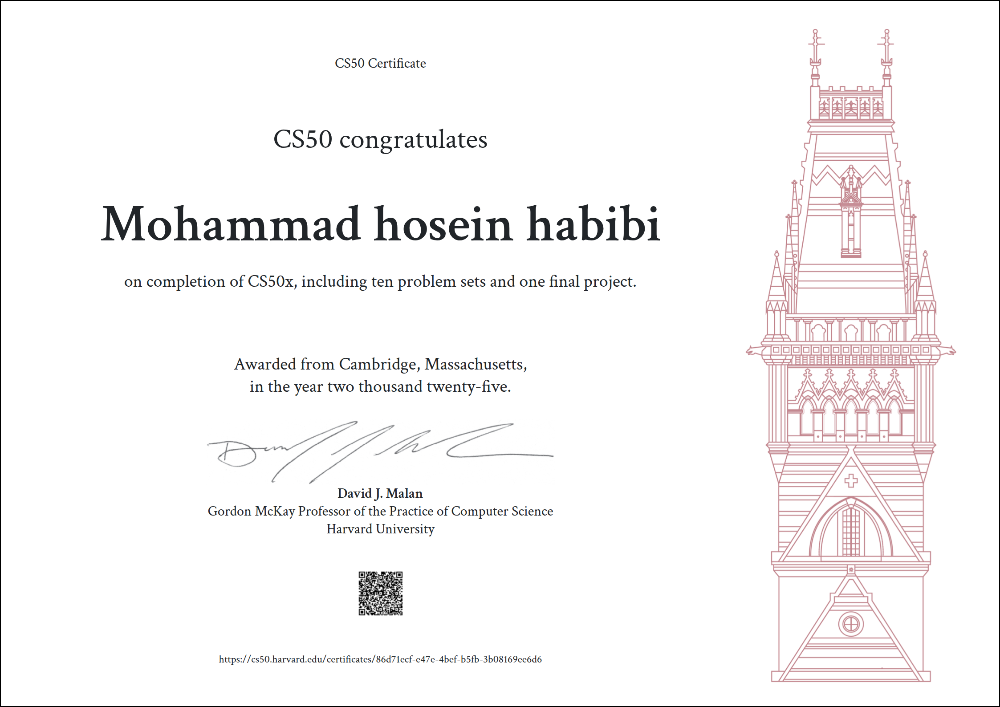

# Harvard CS50x

This is CS50x, Harvard University's introduction to the intellectual enterprises of computer science and the art of programming for majors and non-majors alike, with or without prior programming experience. An entry-level course taught by David J. Malan, CS50x teaches students how to think algorithmically and solve problems efficiently. Topics include abstraction, algorithms, data structures, encapsulation, resource management, security, software engineering, and web development. Languages include C, Python, SQL, and JavaScript plus CSS and HTML. Problem sets inspired by real-world domains of biology, cryptography, finance, forensics, and gaming. The on-campus version of CS50x, CS50, is Harvard's largest course.

Here are all the 9 Problem Sets and 1 Final Project I have completed. All files have been extracted from CS50 AWS based IDE to GitHub.

[Live Demo Final Project](https://www.youtube.com/watch?v=jFaOT7lV1io)

 

## :warning: Disclaimer:

### ❗ **The following codes are for educational purpose only and not intended to be used / submitted as your own solutions.**

### ❗ **Cheating violates the Academic Honesty of the course, not to mention it's totally pointless if you actually want to learn programming.**
